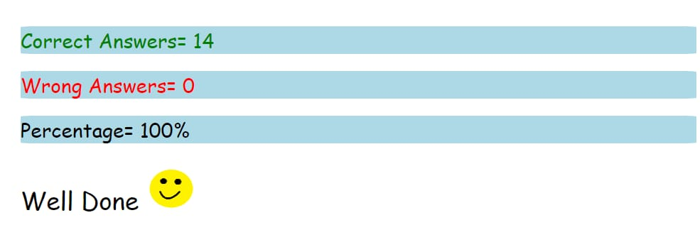

## 1. what are the variable naming conventions in JavaScript?
### ans.* variables are case sensitive
### *variable can be simple chars,multiple char and alpha numeric
### *camel casing
### *any 2 symbols can be used _and $
### *cannot start with a number
### *variable name cannot have spaces
### *cannot use keywords

## 2. Creat a greeting alert(use=>prompt,message,alert)
### ans. letUsername=prompt("enter your name")
###     alert("hello" +Username)

## 3. Write some code so that the values of the below variables switch around
##  Let fish="fly",let bird="swim"  switch the value so that fish hold the value "swim" and the variable bird holds the   value "fly"
### ans. let fish="fly"
###      let bird="swim"
###       a=bird
###        bird=fish
###       fish=a
###      console.log("fish")
###    console.log("bird")

## 4.

        
